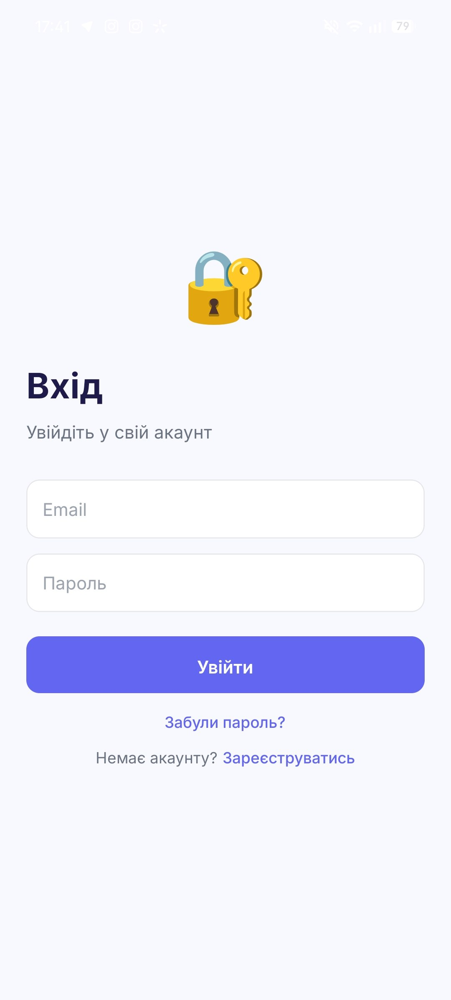
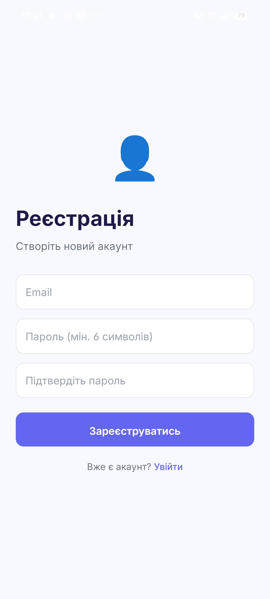
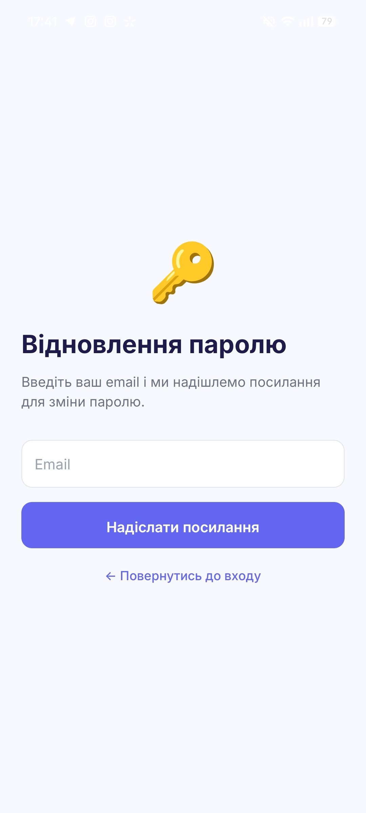
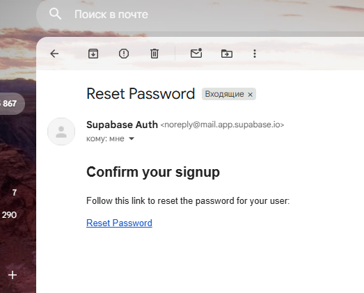
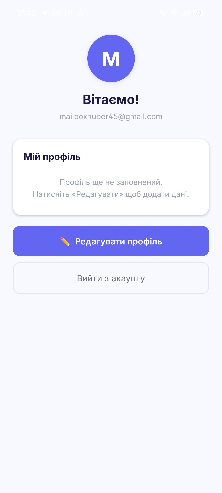

# Лабораторна робота №6: Побудова авторизації та збереження персональних даних у React Native з використанням Supabase Auth та PostgreSQL

## Мета

Набути практичних навичок інтеграції авторизації та обробки персональних даних користувача в мобільному застосунку з використанням Supabase — відкритої альтернативи Firebase.

---

## Firebase vs Supabase

| | Firebase | Supabase |
|---|---|---|
| Автентифікація | Firebase Auth | Supabase Auth |
| База даних | Firestore (NoSQL, документи) | PostgreSQL (SQL, таблиці) |
| Правила безпеки | Firestore Security Rules | Row Level Security (RLS) |
| SDK | `firebase/app` | `@supabase/supabase-js` |
| Збереження сесії (RN) | Окремий плагін | AsyncStorage у `createClient` |
| Видалення акаунту | `deleteUser(currentUser)` | SQL-функція через `supabase.rpc` |
| Ліцензія | Proprietary (Google) | Apache 2.0 (open-source) |
| Self-hosting | Ні | Так |

---

## Опис реалізованого функціоналу

### 1. Автентифікація та безпека

- **Реєстрація:** створення нового облікового запису за email та паролем з валідацією полів на стороні клієнта.
- **Вхід:** авторизація існуючого користувача через `supabase.auth.signInWithPassword`.
- **Відновлення паролю:** скидання пароля через email за допомогою `supabase.auth.resetPasswordForEmail` з deep link редиректом.
- **Вихід із системи:** очищення сесії через `supabase.auth.signOut` та перенаправлення на екран входу.
- **Видалення акаунту:** повторна автентифікація перед видаленням + виклик серверної SQL-функції `delete_user()` через `supabase.rpc`.

### 2. Глобальний стан (AuthContext)

- **AuthProvider:** обгортка на базі React Context API, що слухає зміни стану через `onAuthStateChange` та надає об'єкт користувача всім дочірнім компонентам.
- **Захист маршрутів:** у `_layout.jsx` кожної групи маршрутів реалізовано умовну навігацію через `<Redirect>` — неавторизовані користувачі не мають доступу до групи `(app)`, авторизовані не бачать групу `(auth)`.
- **Loader:** під час початкового завантаження сесії з AsyncStorage відображається індикатор завантаження.

### 3. Робота з персональними даними

- **Структура таблиці:** `id (UUID = uid)`, `name`, `age`, `city`, `updated_at`.
- **Збереження в PostgreSQL:** дані зберігаються у таблиці `profiles` через `supabase.from('profiles').upsert()` — операція одночасно створює або оновлює запис.
- **Завантаження профілю:** при відкритті екрану профіль зчитується з бази, якщо запис відсутній — відображається пропозиція заповнити дані.
- **Row Level Security (RLS):** аналог Firestore Security Rules — кожен користувач може читати та змінювати лише власний рядок через серверну перевірку `auth.uid() = id`.

---

## Інструкція із запуску

### Крок 1 — Створення проєкту в Supabase

1. Заходимо на [supabase.com](https://supabase.com), реєструємось або входимо через GitHub.
2. Натискаємо **New project**, вказуємо назву, пароль бази даних та регіон **EU West (Frankfurt)**.
3. Чекаємо 1–2 хвилини поки проєкт ініціалізується.
4. Переходимо в **Settings → API**, копіюємо **Project URL** та **anon public** ключ.

### Крок 2 — Налаштування бази даних

Переходимо в **SQL Editor** і пишемо туди:

```sql
CREATE TABLE public.profiles (
  id         UUID PRIMARY KEY REFERENCES auth.users(id) ON DELETE CASCADE,
  name       TEXT,
  age        INTEGER CHECK (age >= 1 AND age <= 120),
  city       TEXT,
  updated_at TIMESTAMPTZ DEFAULT now()
);

ALTER TABLE public.profiles ENABLE ROW LEVEL SECURITY;

CREATE POLICY "own_profile" ON public.profiles
  USING (auth.uid() = id)
  WITH CHECK (auth.uid() = id);

CREATE OR REPLACE FUNCTION public.delete_user()
RETURNS void LANGUAGE sql SECURITY DEFINER AS $$
  DELETE FROM auth.users WHERE id = auth.uid();
$$;
```

### Крок 3 — Вимкнення підтвердження email

Щоб додаток не з'їв всі доступні повідомлення одразу переходимо в **Authentication → Providers → Email**, вимикаємо перемикач **Confirm email**, натискаємо **Save**.

### Крок 4 — Клонування репозиторію

```bash
git clone https://github.com/ipz222_ii/MobileLabsRN2026.git
cd MobileLabsRN2026/lab-6_Supabase
npm install --legacy-peer-deps
```

### Крок 5 — Підключення Supabase

Відкриваємо `lib/supabase.js`, вставляємо скопійовані на кроці 1 значення:

```js
import 'react-native-url-polyfill/auto';
import { createClient } from '@supabase/supabase-js';
import AsyncStorage from '@react-native-async-storage/async-storage';

const SUPABASE_URL = 'https://бабабабабабабебебе.supabase.co';
const SUPABASE_ANON_KEY = 'бабабабабеббееб';

export const supabase = createClient(SUPABASE_URL, SUPABASE_ANON_KEY, {
  auth: {
    storage: AsyncStorage,
    autoRefreshToken: true,
    persistSession: true,
    detectSessionInUrl: false,
  },
});
```

### Крок 6 — Запуск

```bash
npx expo start -c --tunnel
```

Скануємо QR-код через **Expo Go** на смартфоні або натискаємо **a** для Android Emulator.

---

## Структура проєкту

```
lab6/
├── app/
│   ├── _layout.jsx
│   ├── index.jsx
│   ├── (auth)/
│   │   ├── _layout.jsx
│   │   ├── login.jsx
│   │   ├── register.jsx
│   │   └── forgot-password.jsx
│   └── (app)/
│       ├── _layout.jsx
│       ├── index.jsx
│       └── edit-profile.jsx
├── context/
│   └── AuthContext.jsx
├── lib/
│   └── supabase.js
├── app.json
└── package.json
```

---

## Скріншоти застосунку

| Логін | Реєстрація | Відновлення паролю | Профіль | Редагування |
| :---: | :---: | :---: | :---: | :---: |
|  |  |  |  |  |

---

## Висновки

У ході виконання лабораторної роботи реалізовано повноцінну систему автентифікації з використанням Supabase Auth, що включає реєстрацію, вхід, відновлення паролю, вихід та видалення акаунту з повторною автентифікацією. Для зберігання персональних даних налаштовано таблицю `profiles` у PostgreSQL, де запис кожного користувача ідентифікується його `uid`. Доступ до даних контролюється через Row Level Security — серверні правила PostgreSQL, що є аналогом Firestore Security Rules. За допомогою React Context API організовано глобальний стан авторизації, а маршрутизація на базі Expo Router забезпечує захист закритих екранів через `<Redirect>` у `_layout.jsx`.